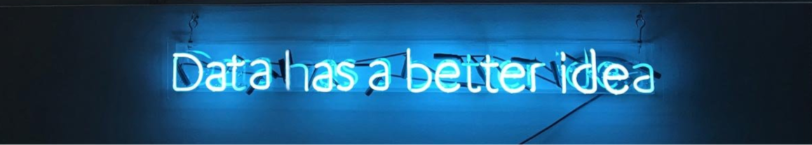

# Olá! 👋🏻 

Boas-vindas ao meu perfil do GitHub! :octocat:

Aqui você fica sabendo um pouco mais sobre mim e o que venho fazendo :mag:

## Informações gerais

- :sun_with_face: Nasci em Recife (PE);
- :mortar_board: Sou recém-formada em biologia pela UFPE;
- :microscope: Durante a graduação trabalhei na área de biofísica, com enfoque nos tópicos de saúde, neurociência, biotecnologia e biologia computacional; 
- 👩🏻‍💻 Me apaixonei assim que descobri a área de ciência de dados e, desde então, estou em migração de carreira;
- 💡 Hoje o meu principal objetivo é atuar como cientista de dados para solucionar problemas de forma data driven, utilizando técnicas de machine learning e estatística.

## Projetos completos
**1. Análise de dados da Zomato** 📊 🍽️

Esse foi o meu primeiro projeto aplicando o Python para a área de dados, onde pude desenvolver a habilidade de trabalhar com datasets e gerar alguns insights com os dados da Zomato. As análises foram feitas no Streamlit.  

:mag: [Clique aqui caso queira saber mais.](https://github.com/deborabmfreitas/painel_gerencial_zomato)

**2. Previsão de vendas da rede de farmácias Rossmann (Regressão)** 💊 

Projeto de regressão/séries temporais de previsão de vendas. Problema de negócio: a rede de farmácias Rossmann precisa iniciar um processo de reformas para atender melhor os consumidores. Para isso, foi solicitada uma previsão da receita da empresa correspondente às próximas 6 semanas, para que o CFO direcione o valor que será investido em cada loja.  

:mag: [Clique aqui caso queira saber mais.](https://github.com/deborabmfreitas/projeto-rossmann-regressao)

**3. Previsão de Churn (Classificação)** 💳

Projeto de classificação que visa prever o churn para ajudar um banco a classificar seus clientes com base em seus dados.  

:mag: [Clique aqui caso queira saber mais.](https://github.com/deborabmfreitas/projeto-churn-classificacao)

**4. Análise de perfil do cliente (Clusterização)** 🛒

Projeto de clusterização que visa analisar diferentes perfis de clientes de uma loja de departamentos para auxiliar a equipe de marketing na tomada de decisão.

:mag: [Clique aqui caso queira saber mais.](https://github.com/deborabmfreitas/projeto-clientes-clusterizacao)

 ## Skills
 
  

    
    
    
    
    
  

  
   
  
  

    
    
    
    
  
  

 

- Estatística e probabilidade
- Python
- SQL
- Git/GitHub (versionamento de código)
- Principais frameworks/bibliotecas: Pandas, Seaborn, Matplotlib, Numpy, Scikit-learn 
- Familiarizada com o ambiente Linux (Ubuntu)
- Familiarizada com o Google Sheets
- Familiarizada em trabalhar com ambiente virtual (venv) 
- Familiarizada com a abordagem de gerenciamento de projetos SCRUM.  
  
 ## Alguns fatos sobre mim
- :coffee: Não funciono sem café;
- :cat2: Adoro gatos e estudar sobre o comportamento deles;
- :headphones: Ouvir música em praticamente todos os momentos;
- :cloud_with_rain: Dias nublados;
- :mountain_biking_woman: :green_heart: Trilhas e outras atividades ao ar livre. 
 
## Meus contatos

  
 
   
  

